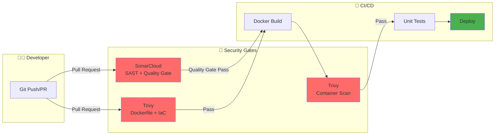

# 🔐 CI/CD com SAST — SonarCloud + Trivy + GitHub Actions

Guia prático para integrar análise estática de segurança (SAST) em pipelines CI/CD usando **SonarCloud** (padrão de mercado) e **Trivy** para containers e IaC.

---

## 🎯 Objetivo

Demonstrar como incorporar **segurança e qualidade de código** desde o início do desenvolvimento (Shift Left Security) usando SonarCloud integrado ao GitHub Actions, com análise automática a cada Pull Request.

---

## 🧠 Conceitos Fundamentais

### O que é SAST?

**SAST (Static Application Security Testing)** analisa o código-fonte, bytecode ou binário **sem executar a aplicação**, identificando vulnerabilidades de segurança em tempo de desenvolvimento.

```
Código Fonte → Análise Estática → Vulnerabilidades + Code Quality → Relatório
```

### Tipos de Análise de Segurança

| Tipo | Sigla | O que analisa | Quando roda |
|------|-------|---------------|-------------|
| Static Application Security Testing | **SAST** | Código-fonte | Build time |
| Dynamic Application Security Testing | **DAST** | App em execução | Runtime |
| Software Composition Analysis | **SCA** | Dependências/libs | Build time |
| Infrastructure as Code Security | **IaC Sec** | Terraform, K8s YAML | Build time |
| Container Security | **CS** | Imagens Docker | Build time |

### Shift Left Security

```
❌ Tradicional:  Dev → Build → Test → Deploy → [Segurança]
✅ Shift Left:   [Segurança] → Dev → Build → Test → Deploy
```

---

## 🛠️ Stack da Aula

### SonarCloud (SAST + Code Quality)

- Versão cloud do **SonarQube** — padrão de mercado
- **Gratuito** para repositórios públicos
- Integração nativa com GitHub (sem servidor para configurar)
- Analisa: vulnerabilidades, bugs, code smells, duplicações, cobertura de testes
- Suporta: Java, Python, JavaScript, TypeScript, C#, Go, PHP, Ruby e mais 20 linguagens
- **Quality Gates** configuráveis que bloqueiam o merge automaticamente

### Trivy (Container + IaC)

- Complementa o SonarCloud cobrindo o que ele não analisa
- Escaneia imagens Docker por CVEs
- Verifica Dockerfile e arquivos de configuração
- 100% open source e gratuito

### Por que essa combinação?

| Cobertura | SonarCloud | Trivy |
|-----------|-----------|-------|
| Código-fonte (SAST) | ✅ | ❌ |
| Code Quality | ✅ | ❌ |
| Cobertura de testes | ✅ | ❌ |
| Dependências (SCA) | ✅ | ✅ |
| Imagem Docker | ❌ | ✅ |
| Dockerfile / IaC | ❌ | ✅ |

---

## 🏗️ Arquitetura da Pipeline



---

## 📁 Estrutura do Projeto

```
📁 cicd-sast-sonar-demo/
├── 📁 .github/workflows/
│   └── sast-scan.yml           # Pipeline de segurança completa
├── 📁 app/
│   ├── app.py                  # Aplicação Python (com vulnerabilidades intencionais)
│   ├── requirements.txt        # Dependências Python
│   ├── test_app.py             # Testes unitários
│   └── Dockerfile              # Imagem Docker
├── sonar-project.properties    # Configuração do SonarCloud
├── .trivyignore                # Exceções do Trivy
└── README.md
```

---

## 🚀 PARTE 1: Configurar SonarCloud (10 min)

### Passo 1: Criar conta no SonarCloud

1. Acesse: **https://sonarcloud.io**
2. Clique em **"Log in with GitHub"**
3. Autorize o acesso ao GitHub

### Passo 2: Criar organização e projeto

1. Clique em **"+"** → **"Analyze new project"**
2. Selecione sua organização GitHub
3. Selecione o repositório `cicd-sast-sonar-demo`
4. Clique em **"Set Up"**
5. Escolha: **"With GitHub Actions"**

### Passo 3: Copiar o SONAR_TOKEN

1. O SonarCloud vai exibir o token gerado
2. **Copie o token** (começa com `sqp_...`)
3. No GitHub: **Settings → Secrets and variables → Actions**
4. Clique em **"New repository secret"**
5. **Name:** `SONAR_TOKEN`
6. **Value:** Cole o token copiado

### Passo 4: Copiar o Organization Key e Project Key

No SonarCloud, vá em:
- **My Account → Organizations** → copie o **Organization Key** (ex: `seu-usuario`)
- **Projects → seu-projeto → Project Settings** → copie o **Project Key** (ex: `seu-usuario_cicd-sast-sonar-demo`)

---

## 📝 PARTE 2: Arquivos de Configuração

### `sonar-project.properties`

```properties
sonar.projectKey=seu-usuario_cicd-sast-sonar-demo
sonar.organization=seu-usuario

sonar.projectName=CICD SAST Demo
sonar.projectVersion=1.0

sonar.sources=app
sonar.tests=app
sonar.test.inclusions=**/test_*.py

sonar.python.coverage.reportPaths=coverage.xml
sonar.python.version=3.9

sonar.exclusions=**/__pycache__/**,**/*.pyc
```

> ⚠️ Substitua `seu-usuario` pelo seu Organization Key e Project Key reais.

---

## 💻 PARTE 3: Aplicação de Exemplo

Aplicação Python com **vulnerabilidades intencionais** para o SonarCloud detectar.

### `app/app.py`

```python
from flask import Flask, request
import sqlite3
import subprocess
import os

app = Flask(__name__)

# ❌ VULNERABILIDADE 1: SQL Injection
@app.route('/user')
def get_user():
    user_id = request.args.get('id')
    conn = sqlite3.connect('users.db')
    # INSECURE: concatenação direta de input do usuário
    query = "SELECT * FROM users WHERE id = " + user_id
    result = conn.execute(query).fetchall()
    return str(result)

# ❌ VULNERABILIDADE 2: Command Injection
@app.route('/ping')
def ping():
    host = request.args.get('host')
    # INSECURE: execução direta de comando com input do usuário
    output = subprocess.check_output(f"ping -c 1 {host}", shell=True)
    return output

# ❌ VULNERABILIDADE 3: Hardcoded Secret
SECRET_KEY = "minha-senha-super-secreta-123"
DB_PASSWORD = "admin123"

# ✅ CORRETO: SQL com parâmetros
@app.route('/user/safe')
def get_user_safe():
    user_id = request.args.get('id')
    conn = sqlite3.connect('users.db')
    result = conn.execute("SELECT * FROM users WHERE id = ?", (user_id,)).fetchall()
    return str(result)

if __name__ == '__main__':
    app.run(debug=True)
```

### `app/test_app.py`

```python
import pytest
from app import app

@pytest.fixture
def client():
    app.config['TESTING'] = True
    with app.test_client() as client:
        yield client

def test_safe_user_route(client):
    response = client.get('/user/safe?id=1')
    assert response.status_code == 200

def test_ping_route_exists(client):
    response = client.get('/ping?host=localhost')
    assert response.status_code in [200, 500]
```

### `app/requirements.txt`

```
flask==2.0.1
requests==2.25.0
pyyaml==5.3.1
cryptography==3.2
pytest==7.0.0
pytest-cov==4.0.0
```

> ⚠️ Versões intencionalmente antigas para demonstrar CVEs.

### `app/Dockerfile`

```dockerfile
FROM python:3.9-slim

WORKDIR /app

COPY requirements.txt .
RUN pip install --no-cache-dir -r requirements.txt

COPY . .

EXPOSE 5000

CMD ["python", "app.py"]
```

---

## 🔄 PARTE 4: Pipeline Completa

**Arquivo:** `.github/workflows/sast-scan.yml`

```yaml
name: 'Security Scan — SonarCloud + Trivy'

on:
  pull_request:
    branches: [ main ]
  push:
    branches: [ main ]

jobs:

  # ─────────────────────────────────────────────────
  # JOB 1: SonarCloud — SAST + Code Quality
  # ─────────────────────────────────────────────────
  sonarcloud:
    name: 'SonarCloud SAST'
    runs-on: ubuntu-latest

    steps:
      - name: Checkout
        uses: actions/checkout@v4
        with:
          fetch-depth: 0  # Necessário para análise de histórico do Sonar

      - name: Setup Python
        uses: actions/setup-python@v5
        with:
          python-version: '3.9'

      - name: Install Dependencies
        run: pip install -r app/requirements.txt

      - name: Run Tests with Coverage
        run: |
          cd app
          pytest test_app.py \
            --cov=. \
            --cov-report=xml:../coverage.xml \
            -v
        continue-on-error: true

      - name: SonarCloud Scan
        uses: SonarSource/sonarcloud-github-action@master
        env:
          GITHUB_TOKEN: ${{ secrets.GITHUB_TOKEN }}
          SONAR_TOKEN: ${{ secrets.SONAR_TOKEN }}

  # ─────────────────────────────────────────────────
  # JOB 2: Trivy — IaC + Dockerfile
  # ─────────────────────────────────────────────────
  trivy-iac:
    name: 'Trivy IaC + Dockerfile'
    runs-on: ubuntu-latest

    steps:
      - name: Checkout
        uses: actions/checkout@v4

      - name: Run Trivy IaC Scan
        uses: aquasecurity/trivy-action@master
        with:
          scan-type: 'config'
          scan-ref: '.'
          format: 'sarif'
          output: 'trivy-iac-results.sarif'
          severity: 'CRITICAL,HIGH,MEDIUM'
          exit-code: '0'

      - name: Upload SARIF to GitHub Security
        uses: github/codeql-action/upload-sarif@v3
        with:
          sarif_file: trivy-iac-results.sarif
          category: trivy-iac

      - name: Trivy IaC Summary (table)
        uses: aquasecurity/trivy-action@master
        with:
          scan-type: 'config'
          scan-ref: '.'
          format: 'table'
          severity: 'CRITICAL,HIGH'
          exit-code: '1'

  # ─────────────────────────────────────────────────
  # JOB 3: Trivy — Container Scan
  # ─────────────────────────────────────────────────
  trivy-container:
    name: 'Trivy Container Scan'
    runs-on: ubuntu-latest
    needs: [sonarcloud, trivy-iac]

    steps:
      - name: Checkout
        uses: actions/checkout@v4

      - name: Build Docker Image
        run: docker build -t demo-app:${{ github.sha }} ./app

      - name: Run Trivy Container Scan
        uses: aquasecurity/trivy-action@master
        with:
          image-ref: 'demo-app:${{ github.sha }}'
          format: 'sarif'
          output: 'trivy-container-results.sarif'
          severity: 'CRITICAL,HIGH'
          exit-code: '0'

      - name: Upload SARIF to GitHub Security
        uses: github/codeql-action/upload-sarif@v3
        with:
          sarif_file: trivy-container-results.sarif
          category: trivy-container

      - name: Trivy Container Summary (table)
        uses: aquasecurity/trivy-action@master
        with:
          image-ref: 'demo-app:${{ github.sha }}'
          format: 'table'
          severity: 'CRITICAL,HIGH'
          exit-code: '1'
```

---

## 🎯 PARTE 5: Quality Gate — O Coração do SonarCloud

O **Quality Gate** é a regra que define se o código está "aprovado" ou não. O SonarCloud bloqueia o merge automaticamente se o Quality Gate falhar.

### Quality Gate padrão (Sonar Way):

| Métrica | Condição de Falha |
|---------|------------------|
| **Security Rating** | Pior que A |
| **Reliability Rating** | Pior que A |
| **Maintainability Rating** | Pior que A |
| **Coverage** | Menor que 80% |
| **Duplications** | Maior que 3% |
| **Security Hotspots Reviewed** | Menor que 100% |

### Como o PR fica bloqueado:

```
Pull Request
├── ✅ Trivy IaC — Passed
├── ✅ Trivy Container — Passed
└── ❌ SonarCloud Quality Gate — FAILED
    └── Merge bloqueado até correção!
```

### Configurar Quality Gate no GitHub:

1. **SonarCloud → Administration → Quality Gates**
2. Crie ou edite um Quality Gate
3. No GitHub: **Settings → Branches → Branch protection rules**
4. Marque: **"Require status checks to pass before merging"**
5. Adicione: `SonarCloud Code Analysis`

---

## 📊 PARTE 6: O que o SonarCloud Detecta

### Categorias de Issues

```
SonarCloud Issues
├── 🔴 Bugs           → Erros que vão causar comportamento incorreto
├── 🟠 Vulnerabilities → Falhas de segurança (SAST)
├── 🟡 Security Hotspots → Código que precisa de revisão manual
├── 🔵 Code Smells    → Problemas de manutenibilidade
└── 📋 Duplications   → Código duplicado
```

### Exemplos do que será detectado no `app.py`:

```
🟠 Vulnerability — SQL Injection
   app/app.py:12 — Make sure this database query is sanitized.
   OWASP A03:2021 - Injection

🟠 Vulnerability — Command Injection  
   app/app.py:20 — Make sure OS commands are sanitized.
   OWASP A03:2021 - Injection

🟡 Security Hotspot — Hardcoded credentials
   app/app.py:23 — Make sure this is not a hard-coded credential.
   OWASP A07:2021 - Identification and Authentication Failures

🔴 Bug — debug=True em produção
   app/app.py:35 — Change this code to not run in debug mode.
```

---

## 🖥️ PARTE 7: Testando Localmente

### Instalar SonarScanner (opcional)

```bash
# Mac
brew install sonar-scanner

# Rodar análise local (precisa do SONAR_TOKEN)
sonar-scanner \
  -Dsonar.projectKey=seu-usuario_cicd-sast-sonar-demo \
  -Dsonar.organization=seu-usuario \
  -Dsonar.sources=app \
  -Dsonar.host.url=https://sonarcloud.io \
  -Dsonar.token=sqp_seu_token_aqui
```

### Instalar e rodar Trivy localmente

```bash
# Mac
brew install aquasecurity/trivy/trivy

# Escanear Dockerfile e configs
trivy config .

# Build e scan da imagem
docker build -t demo-app:local ./app
trivy image --severity HIGH,CRITICAL demo-app:local
```

---

## ✅ PARTE 8: Corrigindo as Vulnerabilidades

### Fix 1: SQL Injection

```python
# ❌ Antes
query = "SELECT * FROM users WHERE id = " + user_id
result = conn.execute(query).fetchall()

# ✅ Depois
result = conn.execute("SELECT * FROM users WHERE id = ?", (user_id,)).fetchall()
```

### Fix 2: Command Injection

```python
# ❌ Antes
output = subprocess.check_output(f"ping -c 1 {host}", shell=True)

# ✅ Depois
output = subprocess.check_output(["ping", "-c", "1", host])
```

### Fix 3: Hardcoded Secrets

```python
# ❌ Antes
SECRET_KEY = "minha-senha-super-secreta-123"

# ✅ Depois
import os
SECRET_KEY = os.environ.get("SECRET_KEY")
if not SECRET_KEY:
    raise ValueError("SECRET_KEY environment variable is required")
```

### Fix 4: debug=True em produção

```python
# ❌ Antes
app.run(debug=True)

# ✅ Depois
debug_mode = os.environ.get("FLASK_DEBUG", "false").lower() == "true"
app.run(debug=debug_mode)
```

### Fix 5: Dependências vulneráveis

```bash
# Atualizar para versões seguras
pip install flask==3.0.0 requests==2.31.0 pyyaml==6.0.1 cryptography==41.0.6
pip freeze > requirements.txt
```

---

## 🔍 PARTE 9: Dashboard do SonarCloud

Após a pipeline rodar, acesse **https://sonarcloud.io** e veja:

```
Dashboard do Projeto
├── 📊 Overview
│   ├── Quality Gate: ✅ Passed / ❌ Failed
│   ├── Bugs: 2
│   ├── Vulnerabilities: 3
│   ├── Security Hotspots: 1
│   ├── Code Smells: 5
│   └── Coverage: 45%
│
├── 🔐 Security
│   ├── SQL Injection (app.py:12)
│   ├── Command Injection (app.py:20)
│   └── Hardcoded credentials (app.py:23)
│
└── 📈 Activity
    └── Histórico de métricas ao longo do tempo
```

---

## 🛡️ Security Gates — Quando Bloquear o Merge?

| Severidade | SonarCloud | Trivy | Ação |
|------------|-----------|-------|------|
| **CRITICAL / Blocker** | ❌ Bloquear | ❌ Bloquear | Merge impedido |
| **HIGH / Critical** | ❌ Bloquear | ❌ Bloquear | Merge impedido |
| **MEDIUM / Major** | ⚠️ Alertar | ⚠️ Alertar | Revisão manual |
| **LOW / Minor** | ℹ️ Informativo | ℹ️ Informativo | Opcional |

---

## 📚 Comparativo: SonarCloud vs Alternativas

| Ferramenta | SAST | Code Quality | Coverage | Container | IaC | Gratuito |
|------------|------|-------------|----------|-----------|-----|----------|
| **SonarCloud** | ✅ | ✅✅ | ✅ | ❌ | ❌ | ✅ (público) |
| **Semgrep** | ✅ | ❌ | ❌ | ❌ | ❌ | ✅ |
| **Trivy** | ❌ | ❌ | ❌ | ✅ | ✅ | ✅ |
| **Snyk** | ✅ | ❌ | ❌ | ✅ | ✅ | ✅* |
| **CodeQL** | ✅✅ | ❌ | ❌ | ❌ | ❌ | ✅ (público) |

> SonarCloud + Trivy = cobertura completa com ferramentas gratuitas

---

## 🎓 Informações da Aula

**Professor:** José Neto  
**Curso:** Arquitetura de Sistemas - FIAP  
**Tema:** CI/CD com SAST — SonarCloud + Trivy + GitHub Actions  
**Data:** 2026  

---

**🔐 Secure by Default. Shift Left. Ship Fast.**
